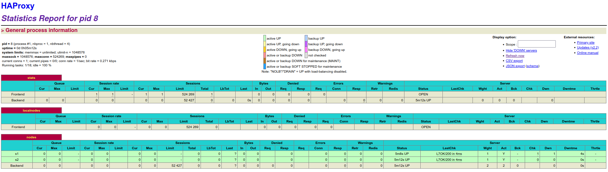
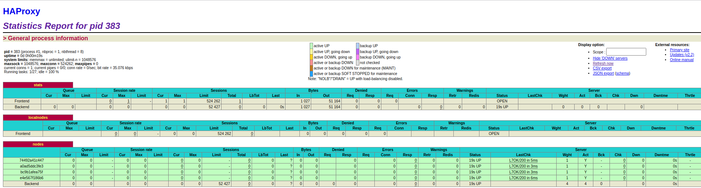
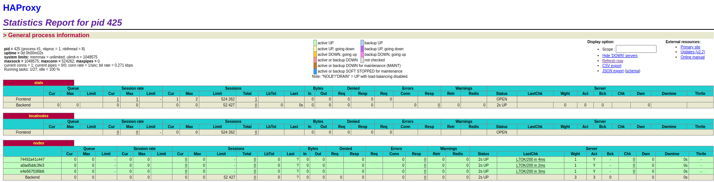

# Laboratoire 4 - Docker

> Auteurs : Lucas Gianinetti, Nicolas Hungerbühler, Cassandre Wojciechowski
>
> Cours : AIT
>
> Date : 12.01.2022


[TOC]

## Introduction

Ce quatrième laboratoire du cours "Administration IT" va nous permettre d'appliquer les connaissances acquises lors des cours théoriques sur la technologie `Docker`. Nous allons pouvoir construire nos propres images et approfondir notre compréhension des processus de supervision pour `Docker`. 

Dans le cadre de ce laboratoire, nous allons également aborder des concepts d'évolutivité dynamique pour des applications en production, ainsi que la gestion décentralisée de serveurs web. 

Le but final de ce travail est d'améliorer la solution créée lors du laboratoire précédent pour obtenir une infrastructure évolutive, dans laquelle nous pourrons ajouter et retirer des "nodes" sans recréer l'image Docker de HAProxy à chaque modification.


## Task 0 - Identify issues and install the tools

**[M1] Do you think we can use the current solution for a production environment? What are the main problems when deploying it in a production environment?**

La solution actuelle, créée lors du laboratoire 3, n'est pas utilisable dans un milieu de production. Elle n'est pas évolutive, nous ne pouvons pas ajouter ou retirer automatiquement des "nodes", il faut le faire manuellement, ce qui n'est pas du tout approprié à de la production.


**[M2] Describe what you need to do to add new `webapp` container to the infrastructure. Give the exact steps of what you have to do without modifiying the way the things are done. Hint: You probably have to modify some configuration and script files in a Docker image.**

Afin de modifier l'infrastructure pour lui ajouter une nouvelle application, nous devons modifier le fichier de configuration de HAProxy pour lui ajouter la nouvelle "node", puis modifier le fichier `docker-compose.yml` pour que l'application soit créée et lié à HAProxy. 

Nous allons ensuite recréer les conteneurs et les relander pour qu'ils prennent en compte les modifications de configuration. 


**[M3] Based on your previous answers, you have detected some issues in the current solution. Now propose a better approach at a high level.**

Pour améliorer la solution, il faudrait rendre les étapes décrites précédemment dynamiques, pour que de nouvelles "nodes" puissent être ajoutées et que la configuration de HAProxy soit adaptée sans intervention manuelle. 


**[M4] You probably noticed that the list of web application nodes is hardcoded in the load balancer configuration. How can we manage the web app nodes in a more dynamic fashion?**

On va avoir besoin d'un service permettant de nous dire quels noeuds sont en marche. Nous pouvons utiliser un outil de management de membres comme `Consul` ou `Serf`. Cela nous permettera d'avoir une liste des noeuds actuellement en marche. Ces outils utilisent le `peer2peer` pour communiquer entre eux et enregistrer leurs états dans le cluster où ils sont tous membres. 


**[M5] In the physical or virtual machines of a typical infrastructure we tend to have not only one main process (like the web server or the load balancer) running, but a few additional processes on the side to perform management tasks.**

**For example to monitor the distributed system as a whole it is common to collect in one centralized place all the logs produced by the different machines. Therefore we need a process running on each machine that will forward the logs to the central place. (We could also imagine a central tool that reaches out to each machine to gather the logs. That's a push vs. pull problem.) It is quite common to see a push mechanism used for this kind of task.**

**Do you think our current solution is able to run additional management processes beside the main web server / load balancer process in a container? If no, what is missing / required to reach the goal? If yes, how to proceed to run for example a log forwarding process?**

La solution actuelle ne nous permet d'avoir qu'un seul processus par conteneur. Pour remédier à cela et avoir plusieurs processus par conteneur, il faut envisager une solution avec un processus de base qui lancerait les services qui doivent tourner côte à côte. 

Un premier processus serait démarré et lancerait l'application web (ou HAProxy, selon le conteneur) et le service de transmission de logs. 


**[M6] In our current solution, although the load balancer configuration is changing dynamically, it doesn't follow dynamically the configuration of our distributed system when web servers are added or removed. If we take a closer look at the `run.sh` script, we see two calls to `sed` which will replace two lines in the `haproxy.cfg` configuration file just before we start `haproxy`. You clearly see that the configuration file has two lines and the script will replace these two lines.**

**What happens if we add more web server nodes? Do you think it is really dynamic? It's far away from being a dynamic configuration. Can you propose a solution to solve this?**

Il faut modifier manuellement la configuration de HAProxy pour ajouter de nouvelles "nodes", ceci n'est pas du tout dynamique. 

Une solution envisageable serait de parcourir la liste rassemblant toutes les "nodes" pour ensuite modifier dynamiquement la configuration de HAProxy, notamment avec un moteur de templates tel que `Handlebars`.


_____________________________

Concernant l'installation des outils, Docker et Docker-Compose étaient déjà installés suite au laboratoire "Load-Balancing" précédemment effectué. 

Cependant, en lançant la commande suivante, nous avons obtenu l'erreur mentionnée ci-dessous : 

```bash
$ docker-compose up --build
ERROR: Pool overlaps with other one on this address space
```

Pour résoudre cette situation de conflit d'adresse pour le réseau, il a fallu lancer les commandes suivantes pour supprimer le réseau Docker responsable du conflit : 

```bash
$ docker network ls

NETWORK ID     NAME                                                      DRIVER    SCOPE
26f6b6e9af93   bridge                                                    bridge    local
13cfd9b0b7ae   docker_default                                            bridge    local
544dd0d58670   host                                                      host      local
5f9a574fe881   none                                                      null      local
5e029413fa29   teaching-heigvd-ait-2019-labo-load-balancing_public_net   bridge    local

$ docker network rm teaching-heigvd-ait-2019-labo-load-balancing_public_net
$ docker-compose up --build
```

Après ces manipulations, les trois conteneurs ont été contruits et démarrés correctement, nous constatons qu'en naviguant à l'adresse http://192.168.42.42, nous obtenons un JSON :

```json
{
 "hello":"world!",
 "ip":"192.168.42.22",
 "host":"aebaefa9b895",
 "tag":"s2",
 "sessionViews":1,
 "id":"sp35jEv01A5MYgdIGt8YnhR6yGVUIEfJ"
}
```


**0.1 Take a screenshot of the stats page of HAProxy at http://192.168.42.42:1936. You should see your backend nodes.**




**0.2 Give the URL of your repository in the lab report.**

L'URL de notre repo est la suivante : https://github.com/Grimlix/Teaching-HEIGVD-AIT-2020-Labo-Docker


## Task 1 - Add a process supervisor to run several processes

**1.1 Take a screenshot of the stats page of HAProxy at http://192.168.42.42:1936. You should see your backend nodes. It should be really similar to the screenshot of the previous task.**


**1.2 Describe your difficulties for this task and your understanding of what is happening during this task. Explain in your own words why are we installing a process supervisor. Do not hesitate to do more research and to find more articles on that topic to illustrate the problem.**

Nous n'avons pas rencontré de difficultés particulières pour accomplir cette tâche, la donnée du laboratoire étant très claire. Le guidage "step-by-step" permet d'accomplir toutes les actions sans problème significatif. 

La difficulté principale serait peut-être de comprendre exactement pourquoi nous faisons ce qui est demandé, mais les articles donnés sous forme de liens dans la donnée permettent de se renseigner plus facilement. 

Nous installons un `process supervisor` pour permettre d'exécuter plusieurs processus différents en même temps dans un seul conteneur. A la base, les conteneurs ont été prévus pour contenir un seul processus, mais il est utile dans différentes situations d'avoir plusieurs processus par conteneur. En effet, il est utile de monitorer les activités d'un conteneur et d'obtenir des logs sur ses activités, ces deux actions sont des processus supplémentaires à ajouter au conteneur. 


## Task 2 - Add a tool to manage membership in the web server cluster

**2.1 Provide the docker log output for each of the containers: `ha`, `s1` and `s2`. You need to create a folder `logs` in your repository to store the files separately from the lab report. For each lab task create a folder and name it using the task number. No need to create a folder when there are no logs. Example:**

```
|-- root folder
  |-- logs
    |-- task 1
    |-- task 3
    |-- ...
```

Tous les logs sont dans le dossier demandé : https://github.com/Grimlix/Teaching-HEIGVD-AIT-2020-Labo-Docker/tree/master/logs/task2.


**2.2 Give the answer to the question about the existing problem with the current solution.**

Notre façon de créer le cluster Serf n'est pas logique, car nous obligeons les webapps à rejoindre le cluster à partir du `ha`. Si le noeud de `ha` n'est pas disponible, les nouvelles webapps ne pourront pas rejoindre le cluster `Serf`. Le flag `--replay` ne servira pas à grand chose car il ne récupérera pas les `event handler` de noeuds rejoignant le cluster, cependant il pourra quand même réagir aux évènements de noeuds quittant le cluster.

Pour y remédier, il faudrait toujours avoir une liste de noeuds existant dans le cluster et utiliser un de ceux-là pour rejoindre le cluster.


**2.3 Give an explanation on how `Serf` is working. Read the official website to get more details about the `GOSSIP` protocol used in `Serf`. Try to find other solutions that can be used to solve similar situations where we need some auto-discovery mechanism.**

`Serf` utilise le protocole `Gossip` pour envoyer des messages au cluster en utilisant "SWIM: Scalable Weakly-consistent Infection-style Process Group Membership Protocol".

`Serf` commence en créant ou en rejoignant un cluster. Lorsqu'un cluster est créé, on attend que d'autres noeuds le rejoignent. Pour rejoindre le cluster, il faut avoir au moins une adresse d'un noeud du cluster. Le nouveau membre va synchroniser son état actuel avec les autres via TCP et commencer à donner ses informations ("gossiper"), au cluster. Le "gossip" se fait via UDP et à intervalles réguliers. 

On va aussi faire la synchronisation d'état régulièrement afin d'obtenir une liste correcte des membres du cluster.

Une autre possiblité serait d'utiliser **consul** de HashyCorp, également. Il utilise aussi le protocol `Gossip` et ajoute plusieurs caractéristiques utiles comme la découverte de services.

> Sources : 
>
> - https://www.serf.io/docs/internals/gossip.
> - https://www.consul.io/docs/architecture/gossip
> - https://www.consul.io/docs/intro/vs/serf


## Task 3 - React to membership changes

**3.1 Provide the docker log output for each of the containers:  `ha`, `s1` and `s2`. Put your logs in the `logs` directory you created in the previous task.**

Tous les logs sont dans le dossier demandé : https://github.com/Grimlix/Teaching-HEIGVD-AIT-2020-Labo-Docker/tree/master/logs/task3.


**3.2 Provide the logs from the `ha` container gathered directly from the `/var/log/serf.log` file present in the container. Put the logs in the `logs` directory in your repo.**

Tous les logs sont dans le dossier demandé : https://github.com/Grimlix/Teaching-HEIGVD-AIT-2020-Labo-Docker/blob/master/logs/task3/s1_logs.


## Task 4 - Use a template engine to easily generate configuration files 

**4.1 You probably noticed when we added `xz-utils`, we have to rebuild the whole image which took some time. What can we do to mitigate that? Take a look at the Docker documentation on [image layers](https://docs.docker.com/engine/userguide/storagedriver/imagesandcontainers/#images-and-layers). Tell us about the pros and cons to merge as much as possible of the command. In other words, compare:**

```
RUN command 1
RUN command 2
RUN command 3
```

**vs.**

```
RUN command 1 && command 2 && command 3
```

**There are also some articles about techniques to reduce the image size. Try to find them. They are talking about `squashing` or `flattening` images.**

Chaque `RUN` ajoute une couche ("layer") à l'image. C'est pourquoi il est déconseillé de le faire, car cela augmente la taille de l'image. Cependant lorsqu'on développe et qu'on veut ajouter une nouvelle commande `RUN`, c'est plus simple d'ajouter une ligne afin de ne pas devoir recréer tout un layer juste pour la nouvelle fonctionnalité. 

Dans le cas du développement, on va plutôt ajouter une ligne `RUN`, mais en production on va tout mettre sur une ligne. 


Article sur le `squashing` d'images : http://jasonwilder.com/blog/2014/08/19/squashing-docker-images/

Article sur le `flattening` d'images : https://l10nn.medium.com/flattening-docker-images-bafb849912ff


**4.2 Propose a different approach to architecture our images to be able to reuse as much as possible what we have done. Your proposition should also try to avoid as much as possible repetitions between your images.**

Nous pourrions faire de l'héritage en créant une image de base avec un `Dockerfile` oontenant les lignes communes aux différentes images en utilisant plusieurs fois la commande `FROM` ("multistage builds"). Les images héritant de l'image de base seront donc de plus petites tailles.


**4.3 Provide the `/tmp/haproxy.cfg` file generated in the `ha` container after each step.  Place the output into the `logs` folder like you already did for the Docker logs in the previous tasks. Three files are expected.**

**In addition, provide a log file containing the output of the `docker ps` console and another file (per container) with `docker inspect <container>`. Four files are expected.**

Tous les logs se trouve à l'emplacement demandé : https://github.com/Grimlix/Teaching-HEIGVD-AIT-2020-Labo-Docker/tree/master/logs/task4.


**4.4 Based on the three output files you have collected, what can you say about the way we generate it? What is the problem if any?**

Le problème est qu'à chaque fois que nous insérons un log, celui-ci remplace le log précédent, seul le dernier log sera donc présent. C'est pourquoi les trois fichiers n'ont qu'une seule ligne. La commande ```handlebars``` dans le script ```member-join.sh``` devrait ajouter un log à la fin du fichier ```/tmp/haproxy.cfg``` et non écrire par dessus.


## Task 5 - Generate a new load balancer configuration when membership changes

**5.1 Provide the file `/usr/local/etc/haproxy/haproxy.cfg` generated in the `ha` container after each step. Three files are expected.**

**In addition, provide a log file containing the output of the `docker ps` console and another file (per container) with `docker inspect <container>`. Four files are expected.**

Tous les logs se trouvent à l'emplacement demandé : https://github.com/Grimlix/Teaching-HEIGVD-AIT-2020-Labo-Docker/tree/master/logs/task5.


**5.2 Provide the list of files from the `/nodes` folder inside the `ha` container. One file expected with the command output.**

Tous les logs se trouvent à l'emplacement demandé : https://github.com/Grimlix/Teaching-HEIGVD-AIT-2020-Labo-Docker/tree/master/logs/task5.


**5.3 Provide the configuration file after you stopped one container and the list of nodes present in the `/nodes` folder. One file expected with the command output. Two files are expected.**

**In addition, provide a log file containing the output of the `docker ps` console. One file expected.**

Tous les logs se trouvent à l'emplacement demandé : https://github.com/Grimlix/Teaching-HEIGVD-AIT-2020-Labo-Docker/tree/master/logs/task5.


**5.4 (Optional:) Propose a different approach to manage the list of backend nodes. You do not need to implement it. You can also propose your own tools or the ones you discovered online. In that case, do not forget to cite your references.**

-


## Task 6 - Make the load balancer automatically reload the new configuration

**6.1 Take a screenshot of the HAProxy stat page showing more than 2 web applications running. Additional screenshots are welcome to see a sequence of experimentations like shutting down a node and starting more nodes.**

**Also provide the output of `docker ps` in a log file. At least one file is expected. You can provide one output per step of your experimentation according to your screenshots.**

Ci-dessous la page de statistiques de HAProxy avec plus de deux applications lancées :




L'output de la commande `docker ps` est contenu dans le fichier https://github.com/Grimlix/Teaching-HEIGVD-AIT-2020-Labo-Docker/blob/master/logs/task6/docker_ps, il a été produit après le lancement de quatre noeuds de backend.

Nous avons ensuite stoppé le container `webapp3`, voici la page de statistiques de HAProxy après cette action :



Le fichier https://github.com/Grimlix/Teaching-HEIGVD-AIT-2020-Labo-Docker/blob/master/logs/task6/docker_ps_after_kill_webapp3 contient l'output de la commande `docker ps` après avoir stoppé la `webapp3`.


**6.2 Give your own feelings about the final solution. Propose improvements or ways to do the things differently. If any, provide references to your readings for the improvements.**

L'infrastructure mise en place dans ce laboratoire fonctionne mais reste basique, il faudrait modifier certains points pour que cette solution soit applicable à une infrastructure réelle :
* Par exemple, `Serf` qui est sensé être un protocole `peer2peer` décentralisé est implémenté pour fonctionner avec un "master fictif" (HAProxy). 
* Il n'y a pas de contrôle de la signature de l'image `NodeJS` téléchargée afin de s'assurer de la provenance de l'image.


**6.3 (Optional:) Present a live demo where you add and remove a backend container.**

-


## Difficulties 

Nous n'avons pas rencontré de problèmes particuliers lors de ce laboratoire, notamment grâce au guidage "step-by-step" mentionné plus haut et aux nombreuses références données pour illustrer les concepts et expliquer comment utiliser les outils. 


## Conclusion

Nous avons pu terminer ce laboratoire dans le temps imparti et celui-ci nous a permis d'appliquer les concepts vu en cours, comme par exemple, la technologie des conteneurs avec `Docker`. 

Nous avons réussi à rendre notre infrastructure plus dynamique qu'elle ne l'était au départ, nous pouvons maintenant ajouter ou retirer des "nodes" dynamiquement, sans intervention manuelle supplémentaire. 