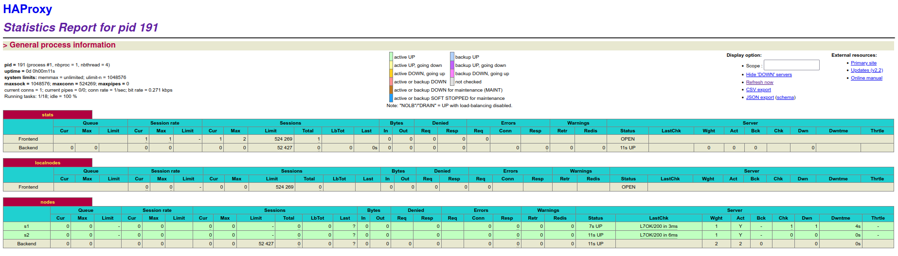

# Laboratoire 4 - Docker

> Auteurs : Lucas Gianinetti, Nicolas Hungerbühler, Cassandre Wojciechowski
>
> Cours : AIT
>
> Date : 12.01.2022


[TOC]

## Introduction

// TODO


## Task 0 - Identify issues and install the tools

**[M1] Do you think we can use the current solution for a production environment? What are the main problems when deploying it in a production environment?**

// TODO

**[M2] Describe what you need to do to add new `webapp` container to the infrastructure. Give the exact steps of what you have to do without modifiying the way the things are done. Hint: You probably have to modify some configuration and script files in a Docker image.**

// TODO

**[M3] Based on your previous answers, you have detected some issues in the current solution. Now propose a better approach at a high level.**

// TODO

**[M4] You probably noticed that the list of web application nodes is hardcoded in the load balancer configuration. How can we manage the web app nodes in a more dynamic fashion?**

// TODO

**[M5] In the physical or virtual machines of a typical infrastructure we tend to have not only one main process (like the web server or the load balancer) running, but a few additional processes on the side to perform management tasks.**

**For example to monitor the distributed system as a whole it is common to collect in one centralized place all the logs produced by the different machines. Therefore we need a process running on each machine that will forward the logs to the central place. (We could also imagine a central tool that reaches out to each machine to gather the logs. That's a push vs. pull problem.) It is quite common to see a push mechanism used for this kind of task.**

**Do you think our current solution is able to run additional management processes beside the main web server / load balancer process in a container? If no, what is missing / required to reach the goal? If yes, how to proceed to run for example a log forwarding process?**

// TODO

**[M6] In our current solution, although the load balancer configuration is changing dynamically, it doesn't follow dynamically the configuration of our distributed system when web servers are added or removed. If we take a closer look at the `run.sh` script, we see two calls to `sed` which will replace two lines in the `haproxy.cfg` configuration file just before we start `haproxy`. You clearly see that the configuration file has two lines and the script will replace these two lines.**

**What happens if we add more web server nodes? Do you think it is really dynamic? It's far away from being a dynamic configuration. Can you propose a solution to solve this?**

// TODO

_____________________________

Concernant l'installation des outils, Docker et Docker-Compose étaient déjà installés suite au laboratoire Load-Balancing précédemment effectué. 

Cependant, en lançant la commande suivante, nous avons obtenu l'erreur mentionnée ci-dessous : 

```bash
$ docker-compose up --build
ERROR: Pool overlaps with other one on this address space
```

Pour résoudre cette situation de conflit d'adresse pour le réseau, il a fallu lancer les commandes suivantes pour supprimer le réseau Docker responsable du conflit : 

```bash
$ docker network ls

NETWORK ID     NAME                                                      DRIVER    SCOPE
26f6b6e9af93   bridge                                                    bridge    local
13cfd9b0b7ae   docker_default                                            bridge    local
544dd0d58670   host                                                      host      local
5f9a574fe881   none                                                      null      local
5e029413fa29   teaching-heigvd-ait-2019-labo-load-balancing_public_net   bridge    local

$ docker network rm teaching-heigvd-ait-2019-labo-load-balancing_public_net
$ docker-compose up --build
```

Après ces manipulations, les trois conteneurs ont été contruits et démarrés correctement, nous constatons qu'en naviguant à l'adresse http://192.168.42.42, nous obtenons un JSON :

```json
{
 "hello":"world!",
 "ip":"192.168.42.22",
 "host":"aebaefa9b895",
 "tag":"s2",
 "sessionViews":1,
 "id":"sp35jEv01A5MYgdIGt8YnhR6yGVUIEfJ"
}
```


**0.1 Take a screenshot of the stats page of HAProxy at http://192.168.42.42:1936. You should see your backend nodes.**


**0.2 Give the URL of your repository in the lab report.**

L'URL de notre repo est la suivante : https://github.com/Grimlix/Teaching-HEIGVD-AIT-2020-Labo-Docker


## Task 1 - Add a process supervisor to run several processes

**1.1 Take a screenshot of the stats page of HAProxy at http://192.168.42.42:1936. You should see your backend nodes. It should be really similar to the screenshot of the previous task.**




**1.2 Describe your difficulties for this task and your understanding of what is happening during this task. Explain in your own words why are we installing a process supervisor. Do not hesitate to do more research and to find more articles on that topic to illustrate the problem.**

Nous n'avons pas rencontré de difficultés particulières pour accomplir cette tâche, la donnée du laboratoire étant très claire. Le guidage "step-by-step" permet d'accomplir toutes les actions sans problème significatif. 

La difficulté principale serait peut-être de comprendre exactement pourquoi nous faisons ce qui est demandé, mais les articles donnés sous forme de liens dans la donnée permettent de se renseigner plus facilement. 

Nous installons un `process supervisor` pour permettre d'exécuter plusieurs processus différents en même temps dans un seul conteneur. A la base, les conteneurs ont été prévus pour contenir un seul processus, mais il est utile dans différentes situations d'avoir plusieurs processus par conteneur. En effet, il est utile de monitorer les activités d'un conteneur et d'obtenir des logs sur ses activités, ces deux actions sont des processus supplémentaires à ajouter au conteneur. 

// TODO : compléter


## Task 2 - Add a tool to manage membership in the web server cluster

**2.1 Provide the docker log output for each of the containers: `ha`, `s1` and `s2`. You need to create a folder `logs` in your repository to store the files separately from the lab report. For each lab task create a folder and name it using the task number. No need to create a folder when there are no logs. Example:**

```
|-- root folder
  |-- logs
    |-- task 1
    |-- task 3
    |-- ...
```


**2.2 Give the answer to the question about the existing problem with the current solution.**


**2.3 Give an explanation on how `Serf` is working. Read the official website to get more details about the `GOSSIP` protocol used in `Serf`. Try to find other solutions that can be used to solve similar situations where we need some auto-discovery mechanism.**


## Task 3 - React to membership changes

**3.1 Provide the docker log output for each of the containers:  `ha`, `s1` and `s2`. Put your logs in the `logs` directory you created in the previous task.**


**3.2 Provide the logs from the `ha` container gathered directly from the `/var/log/serf.log` file present in the container. Put the logs in the `logs` directory in your repo.**


## Task 4 - Use a template engine to easily generate configuration files 

**4.1 You probably noticed when we added `xz-utils`, we have to rebuild the whole image which took some time. What can we do to mitigate that? Take a look at the Docker documentation on [image layers](https://docs.docker.com/engine/userguide/storagedriver/imagesandcontainers/#images-and-layers). Tell us about the pros and cons to merge as much as possible of the command. In other words, compare:**

```
RUN command 1
RUN command 2
RUN command 3
```

**vs.**

```
RUN command 1 && command 2 && command 3
```

**There are also some articles about techniques to reduce the image size. Try to find them. They are talking about `squashing` or `flattening` images.**


**4.2 Propose a different approach to architecture our images to be able to reuse as much as possible what we have done. Your proposition should also try to avoid as much as possible repetitions between your images.**


**4.3 Provide the `/tmp/haproxy.cfg` file generated in the `ha` container after each step.  Place the output into the `logs` folder like you already did for the Docker logs in the previous tasks. Three files are expected.**

**In addition, provide a log file containing the output of the `docker ps` console and another file (per container) with `docker inspect <container>`. Four files are expected.**


**4.4 Based on the three output files you have collected, what can you say about the way we generate it? What is the problem if any?**


## Task 5 - Generate a new load balancer configuration when membership changes

**5.1 Provide the file `/usr/local/etc/haproxy/haproxy.cfg` generated in the `ha` container after each step. Three files are expected.**

**In addition, provide a log file containing the output of the `docker ps` console and another file (per container) with `docker inspect <container>`. Four files are expected.**


**5.2 Provide the list of files from the `/nodes` folder inside the `ha` container. One file expected with the command output.**


**5.3 Provide the configuration file after you stopped one container and the list of nodes present in the `/nodes` folder. One file expected with the command output. Two files are expected.**

**In addition, provide a log file containing the output of the `docker ps` console. One file expected.**


**5.4 (Optional:) Propose a different approach to manage the list of backend nodes. You do not need to implement it. You can also propose your own tools or the ones you discovered online. In that case, do not forget to cite your references.**


## Task 6 - Make the load balancer automatically reload the new configuration

**6.1 Take a screenshots of the HAProxy stat page showing more than 2 web applications running. Additional screenshots are welcome to see a sequence of experimentations like shutting down a node and starting more nodes.**

**Also provide the output of `docker ps` in a log file. At least one file is expected. You can provide one output per step of your experimentation according to your screenshots.**


**6.2 Give your own feelings about the final solution. Propose improvements or ways to do the things differently. If any, provide references to your readings for the improvements.**


**6.3 (Optional:) Present a live demo where you add and remove a backend container.**


## Difficulties 

// TODO : describe the problems encountered & the solutions found


## Conclusion